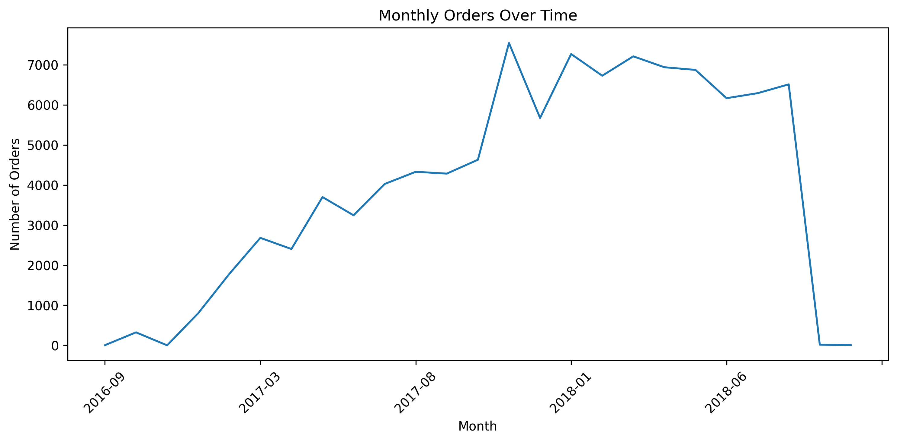
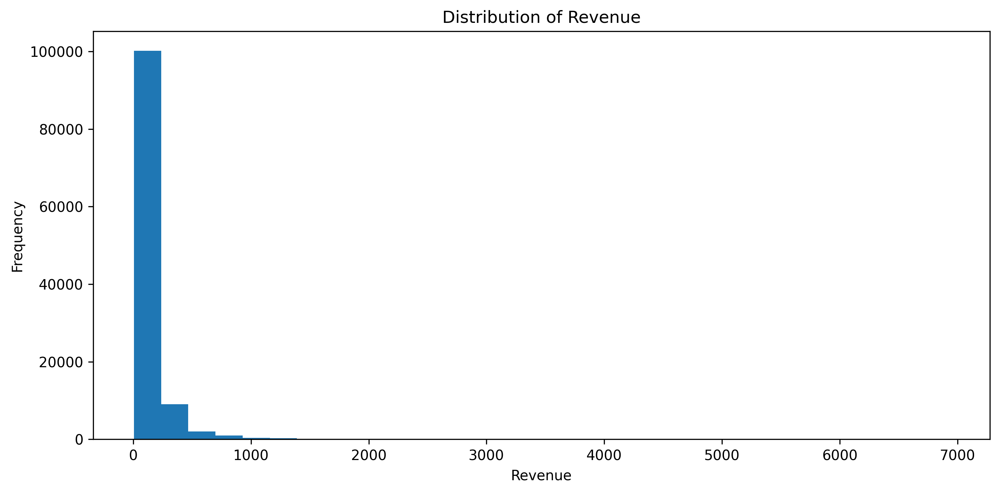
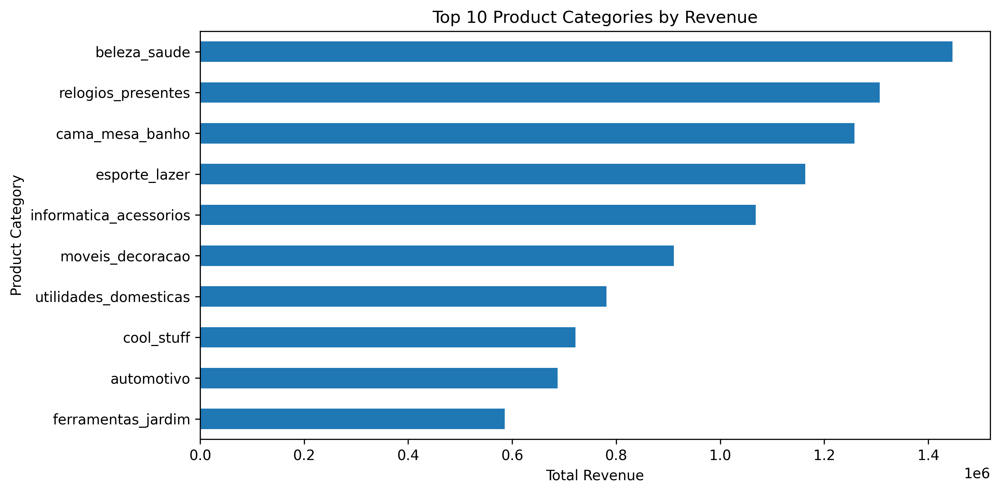
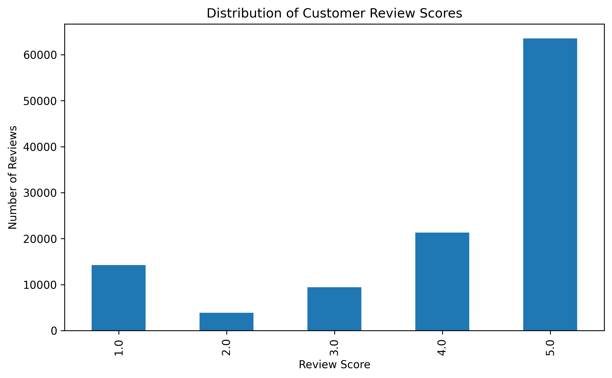
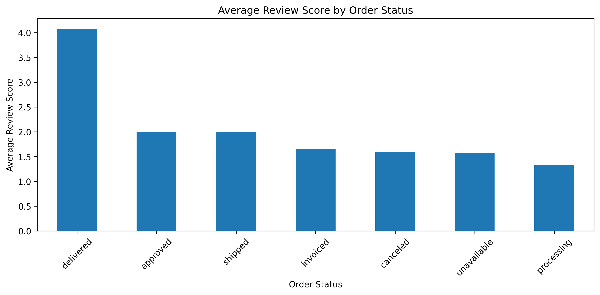
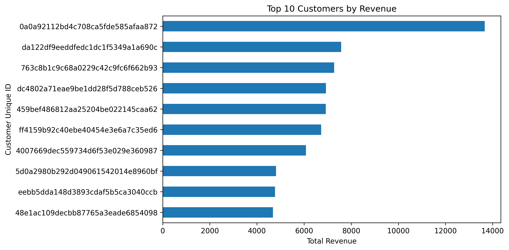

# E-commerce Analytics Project: Sales Trends & Customer Insights

This project applies exploratory data analysis (EDA) techniques to a real-world e-commerce dataset to uncover insights into sales performance, customer behaviour, and revenue drivers.

The analysis demonstrates how data-driven insights can be used to support business decision-making and improve overall performance.

---

## Tools Used
- Python (Pandas, Matplotlib)
- Jupyter Notebook

---

## Key Features
- Data cleaning and preprocessing
- Feature engineering (revenue calculation)
- Exploratory data analysis (EDA)
- Customer and product performance analysis
- Customer satisfaction analysis
- Business insights and recommendations

---

## Key Visualisations

### Monthly Orders Over Time

### Revenue Distribution

### Top Product Categories by Revenue

### Customer Review Score Distribution

### Customer Satisfaction by Order Status

### Top Customers by Revenue

---

## Key Insights
- Revenue is concentrated among a small number of customers  
- Sales performance is driven by key product categories  
- Most transactions are low-value, with a small number of high-value orders  
- Customer satisfaction is generally high  
- Delivery performance significantly impacts customer experience  

---

## Future Work
- Customer segmentation  
- Demand forecasting  
- Predictive modelling using machine learning  

---

## Author
Tan Saritasurarak
